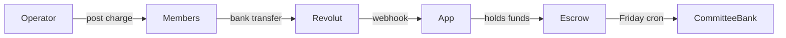

# Collection Platform

Intermediary collector for groups (buildings, school parent societies, associations): post monthly charges, collect bank transfers via Revolut, hold funds during the week, and pay out to the committee bank every **Friday**.

## How it works



1. Operator creates a **group** with members and a collection IBAN
2. Operator posts a **charge** (maintenance, dues, event, etc.) — split equally, by area, or by custom weight
3. Members pay by bank transfer with a unique **payment reference**
4. Revolut webhook matches payments → balances update on the dashboard (10s polling)
5. Every **Friday**, collected funds transfer to the group's **committee bank account**

## Project structure

```
PropertyManagementApp/
  backend/          FastAPI API (Vercel serverless)
  frontend/         React + Vite + Tailwind operator UI
  db/migrations/    Neon Postgres schema
  public/           Built frontend (generated at deploy)
  scripts/build.py  Vercel build — compiles frontend into public/
```

## Setup

### 1. Database (Neon via Vercel)

1. Link the repo to Vercel: `vercel link`
2. Add Neon Postgres: `vercel integration add neon`
3. Pull env vars locally: `vercel env pull .env.local`
4. Run migrations:

```bash
cd backend
python -m venv .venv
.venv\Scripts\activate   # Windows
pip install -r requirements.txt
python scripts/migrate.py
```

5. Create an operator account:

```bash
python scripts/create_operator.py you@example.com your-password "Your Name"
```

### 2. Local development

**Backend** (from `backend/`):

```bash
pip install -r requirements.txt
copy ..\.env.local ..\.env
uvicorn app.main:app --reload --port 8000
```

**Frontend** (from `frontend/`):

```bash
npm install
copy .env.example .env
npm run dev
```

Open http://localhost:5173 and sign in.

### 3. Required environment variables

| Variable | Purpose |
|----------|---------|
| `DATABASE_URL` | Neon Postgres connection string |
| `JWT_SECRET` | Signs operator login tokens |
| `CRON_SECRET` | Protects scheduled payout endpoint |
| `REVOLUT_API_KEY` | Revolut Business API (webhooks + Friday payouts) |
| `REVOLUT_SOURCE_ACCOUNT_ID` | Revolut account holding collected funds |

See `.env.example` for Twilio and SendGrid options.

## API routes

Both prefixes work (hybrid rename):

- `/api/groups/*` — preferred
- `/api/buildings/*` — legacy alias

## Vercel deployment

1. Push to GitHub and import in [Vercel](https://vercel.com/new).
2. API under `/api/*`; frontend static from `public/`.
3. Enable Neon integration for `DATABASE_URL`.

**Cron:** Weekly payout — `GET /api/cron/weekly-payout` Fridays 04:00 UTC (`vercel.json`). Set `CRON_SECRET`.

**Webhooks:** Revolut Business → `https://your-app.vercel.app/api/webhooks/revolut`

## Payment reference format

```
{group_id}-{member_id}-{YYYYMM}
```

## Split methods

| Method | Use case |
|--------|----------|
| `by_area` | Buildings — charge by apartment m² |
| `equal` | School societies — same amount per member |
| `custom_weight` | Custom share weights per member |

## Features

- Groups & members CRUD (buildings, schools, associations)
- Flexible charge split (area / equal / weight)
- Bank transfer collection via Revolut Business webhooks
- **Held for payout** vs **paid to committee** tracking
- Friday automated payouts to committee BoC
- Committee bank setup in UI
- SMS/email charge notices and payment receipts
- Live dashboard polling (10s)

## Phase 2 (planned)

- Owner portal (signed links — balance, QR, reference)
- PDF reports (monthly summary, member statements)
